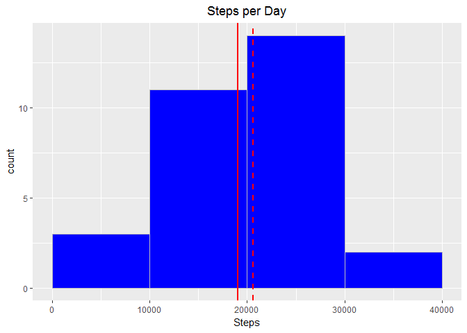
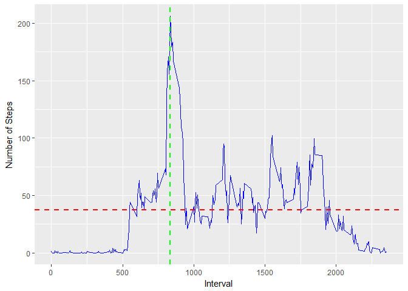
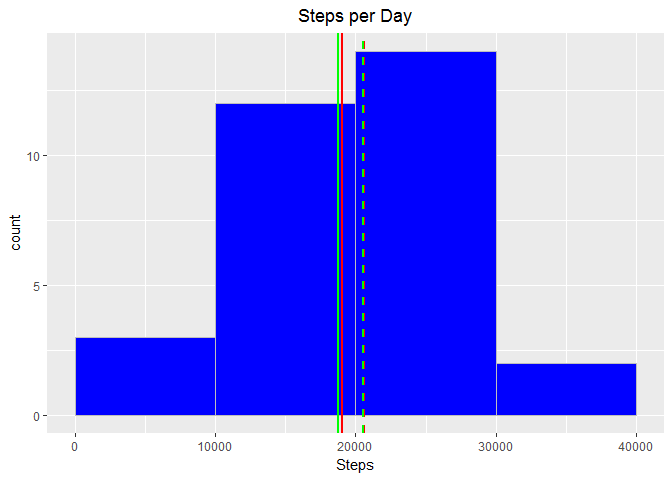
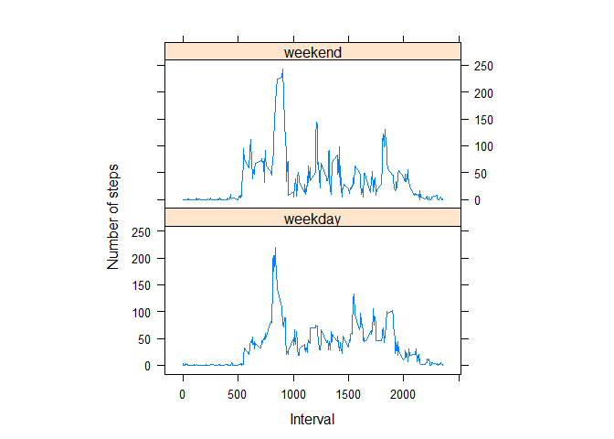

# Reproducible Research: Peer Assessment 1


```r
# Required Packages
require(ggplot2)
require(lubridate)
require(scales)
require(lattice)

# Global Variables
data.directory = "activity"
data.filename = "activity.csv"
```

## Loading and preprocessing the data

The loading and preprocessing involved the following steps:

- load the csv file
- convert any date variables to date objects (i.e. date)
- create a new variable, data_type, to distinguish between weekday and weekend

The output can be seen below:


```r
df <- read.csv(paste(data.directory, data.filename, sep="/"), header=T)
df$date <- as.Date(df$date, format="%Y-%M-%d")
df$day_week <- as.numeric(format(df$date, "%w"))
df$day_type <- "weekend"
df[df$day_week > 0 & df$day_week < 6, "day_type"] = "weekday"
df$day_type = as.factor(df$day_type)
```

## What is mean total number of steps taken per day?

The data set contains incomplete rows and these rows will be ignored. First, we will make a histogram of the total number of steps taken each day.


```r
df.day.steps <- aggregate(steps~date, df, sum)
mean.steps <- mean(df.day.steps$steps)
median.steps <- median(df.day.steps$steps)

p <- ggplot(df.day.steps, aes(x=steps)) +
  geom_histogram(breaks=seq(0,40000, by=10000), col="grey", fill="blue") +
  labs(title="Steps per Day", x="Steps", "Frequency") +
  theme(plot.title=element_text(hjust=0.5)) +
  geom_vline(xintercept = mean.steps, col="red", size=1) +
  geom_vline(xintercept = median.steps, col="red", linetype="dashed", size=1)
print(p)
```

<!-- -->

The mean (19,020 steps) is seen as the solid red line while the median (20,598 steps) is the dashed red line.

## What is the average daily activity pattern?


```r
daily.activity.mean <- mean(df$steps, na.rm=T)
daily.activity.df <- aggregate(steps~interval, df, mean, na.rm=T)
daily.activity.max.interval <- daily.activity.df[which(daily.activity.df$steps==max(daily.activity.df$steps)), "interval"]

p <- ggplot(daily.activity.df, aes(x=interval, y=steps)) +
  geom_line(col="blue") +
  labs(x="Interval", y="Number of Steps") +
  geom_hline(yintercept=daily.activity.mean, col="red", linetype="dashed", size=1) +
  geom_vline(xintercept=daily.activity.max.interval, col="green", linetype="dashed", size=1)
print(p)
```

<!-- -->

The average number of steps for a five minute interval is 37 steps and is seen as the red dashed line.

The 5 minute interval with the maximum number of average steps is 835 and is seen as the green dashed line above.

## Imputing missing values


```r
num.missing = sum(is.na(df$steps))
```

The number of observations with missing values is 2,304.

The imputation method implemented is replacing missing values with the average number of steps for the interval.


```r
df.imputed <- df

df.imputed[is.na(df.imputed$steps), "steps"] = round(daily.activity.df[daily.activity.df$interval== df.imputed[is.na(df.imputed$steps), "interval"], "steps"])

df.imputed.day.steps <- aggregate(steps~date, df.imputed, sum)
mean.imputed.steps <- mean(df.imputed.day.steps$steps)
median.imputed.steps <- median(df.imputed.day.steps$steps)

p <- ggplot(df.imputed.day.steps, aes(x=steps)) +
  geom_histogram(breaks=seq(0,40000, by=10000), col="grey", fill="blue") +
  labs(title="Steps per Day", x="Steps", "Frequency") +
  theme(plot.title=element_text(hjust=0.5)) +
  geom_vline(xintercept = mean.steps, col="red", size=1) +
  geom_vline(xintercept = median.steps, col="red", linetype="dashed", size=1) +
  geom_vline(xintercept = mean.imputed.steps, col="green", size=1) +
  geom_vline(xintercept = median.imputed.steps, col="green", linetype="dashed", size=1)
print(p)
```

<!-- -->

The new mean (18,754 steps) with the imputation method is seen as the solid green line. The new mean can be compared to the original mean  (19,020 steps) seen as the red line which was calculated by removing the incomplete rows.

The new median (20,525 steps) is the dashed green line and the original median (20,598 steps) as the dashed red line.

The new mean is 266 smaller than the orginal mean and the new median is 72.5 smaller than the orginal. We can see that the mean is more affected by the imputation methods and the above imputation method uses a similar number of steps for a specific interval while keeping the same number of intervals. The first imputation method of removing the missing values better reflects the number of steps, but removes some of the intervals from the calculations. Since the differences between the means and median is small it does not matter if missing values are removed or imputed with similar average interval values.

## Are there differences in activity patterns between weekdays and weekends?


```r
weekday_weekend.df <- aggregate(steps~interval+day_type, df.imputed, mean)

xyplot(steps~interval | day_type, data=weekday_weekend.df, aspect = 1/2, type="l",
       ylab="Number of steps", xlab="Interval")
```

<!-- -->

